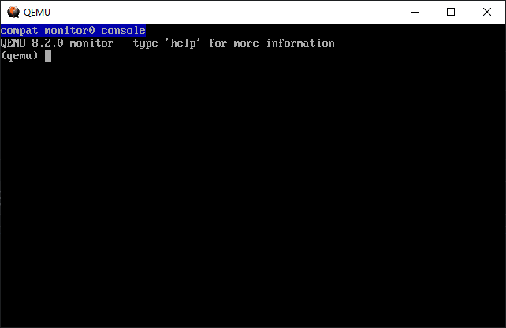
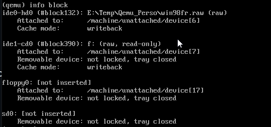
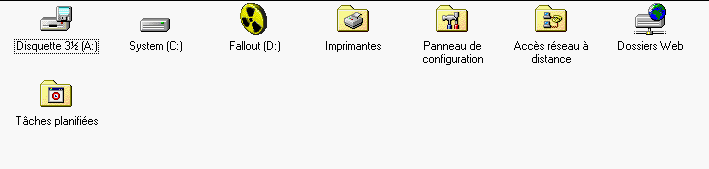

# Présentation
La console permet d'envoyer des commandes à QEMU, que cela soit pour:

- Changer de disque
- Collecter des informations
- Mettre en pause le guest.
- ...

 

## Lancement de la console
### Lancement de la console en mode SDL

**Windows**

La console peut être lancée en pressant les touches [Ctrl]+[Alt]+[2]

 

## Aide
Dans la console taper `help`

Pour obtenir de l'aide sur une commande précise taper `help <commande>`

 

## Liste des commandes
Non exhaustif

- change: permet de modifier un média amovible (à tester: changer les options d'affichage d'un VNC, et changer le mot de passe utilisé sur un VNC)

 

# Medias amovibles
## Changement du CD-Rom

Procédure:

- Identification des médias disponibles, taper `info block` 

- Pour changer le CD-Rom désigné par `ide1-cd0`, taper `change ide1-cd0 <lien vers l'image|lecteur>`

 

Exemple de résultat avec la commande:

- Partie console  

- Changement automatique dans Windows 98  

 

Comme déjà indiqué, QEMU fonctionne avec un lecteur physique, un lecteur virtuel ou directement avec certaines images. Dans mon cas je n'ai plus de lecteur physique comme beaucoup d'entre nous sur cette machine.

