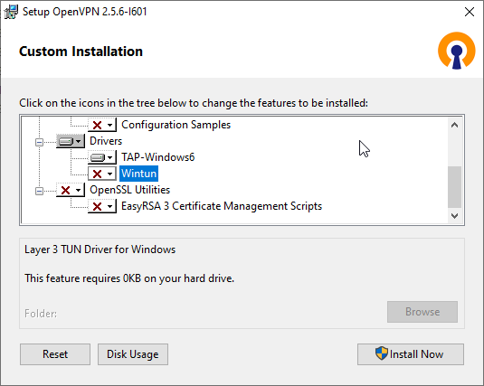
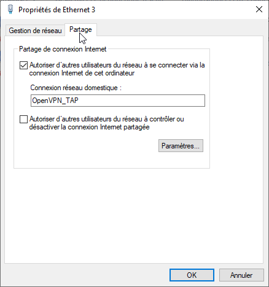
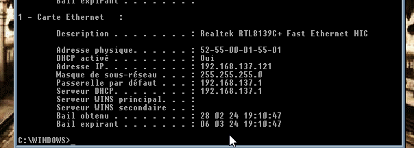
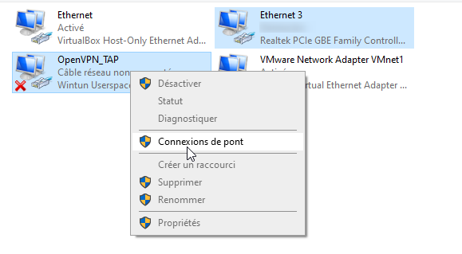

Sommaire:  
- [Conseils](#Conseils)  
- [Interface TAP OpenVPN](#Interface-Tap-OpenVPN)  
- [Partage de connexion](Partage-de-connexion)  
- [Mode Bridge](#Mode-Bridge)  
- [Debug](#Debug)  
  - [Cas: 'Could not Open...'](#cas-tap-could-not-open-openvpn_tap)  

<br>

----
## Modes Réseaux
Différents modes:  
- Par défaut :

    * Connexion au net possible  
    * Impossible de dialoguer avec l'hôte.  
- [Partage de connexion](Partage-de-connexion):  
    - Connexion au net possible  
    - Création d'un subnet où l'interface TAP est routeur  
        - Dialogue hôte<>guest possible  
        - Dialogue avec les machines du réseau impossible  
- [Mode Bridge](#Mode-Bridge)  
    - connexion au net possible  
    - Machine considérée comme appartenant au réseau de l'hôte  
    - Dialogue hôte<>guest possible  
    - Dialogue machines<>guest possible  
    - Dialogue machines<>host possible  

<br>
- Nulla et rhoncus turpis. Mauris ultricies elementum leo. Duis efficitur
  accumsan nibh eu mattis. Vivamus tempus velit eros, porttitor placerat nibh
  lacinia sed. Aenean in finibus diam.

    * Duis mollis est eget nibh volutpat, fermentum aliquet dui mollis.
    * Nam vulputate tincidunt fringilla.
    * Nullam dignissim ultrices urna non auctor.

- Nulla et rhoncus turpis. Mauris ultricies elementum leo. Duis efficitur
  accumsan nibh eu mattis. Vivamus tempus velit eros, porttitor placerat nibh
  lacinia sed. Aenean in finibus diam.
    * Duis mollis est eget nibh volutpat, fermentum aliquet dui mollis.
    * Nam vulputate tincidunt fringilla.
    * Nullam dignissim ultrices urna non auctor.


!!! NOTE 
    Si vous avez l'intention d'avoir plusieurs machines sous le même réseau, pensez à changer l'adresse MAC dans la ligne de commande.

<br>

## Interface TAP OpenVPN
Téléchargez [OpenVPN](https://openvpn.net/community-downloads/)

- Lancez l'installation d'OpenVPN, **mais n'installez que le TAP**.  
  
- Accéder aux Connexions Réseaux:  
    - Windows 10 :  
        - Pressez les touches ++Win+R++  
        - Taper   
        ```
        ncpa.cpl
        ```
       - Lancer   
     - Windows 11 : Panneau de configuration → Réseau et Internet → Centre Réseau et partage → Modifier paramètres de la carte  
- Renommez votre connexion (j'ai pris OpenVPN_TAP)  

<br>

!!! WARNING "Le nom de la connexion sera utilisé dans la ligne de commande pour `ifname` !"


<br>

----
## Partage de connexion
Nécessite l'installation d'une [interface TAP](#Interface-TAP-OpenVPN)

<br>

Configuration carte réseau physique Hôte  
- Aller sur la connexion de la carte physique  
- Clic droit &larr; Propriétés  
- Aller sur l'onglet `Partage`  
- Configurer ainsi, en permettant le partage pour la connexion "TAP"  


<br>

Une fois en place on voit que l'on a deux réseaux différents
Host  


Guest  


<br>

----
## Mode Bridge
Nécessite l'installation d'une [interface TAP](#Interface-TAP-OpenVPN)

<br>

Caractéristiques du mode Bridge:  
- Passerelle identique pour tout le monde  
- Serveur DHCP du réseau peuvent définir l'IP  
- L'hôte à une adresse IP  
- La machine guest à sa propre IP  

<br>

Configuration pour le mode Bridge  
- Sélectionnez votre carte réseau ainsi que le TAP, faites un clic droit et utilisez "Ajouter un pont"    
  
- Editez les propriétés du pont pour configurer l'IPv4 en Statique (Important)  

<br>

!!! Note
    Normalement tout est opérationnel
    

Si QEMU bloque: "tap: Could not open 'OpenVPN_TAP'"

<br>

----
## Debug
### Cas "tap: Could not open 'OpenVPN_TAP'"
