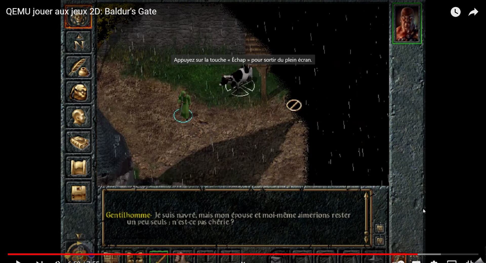
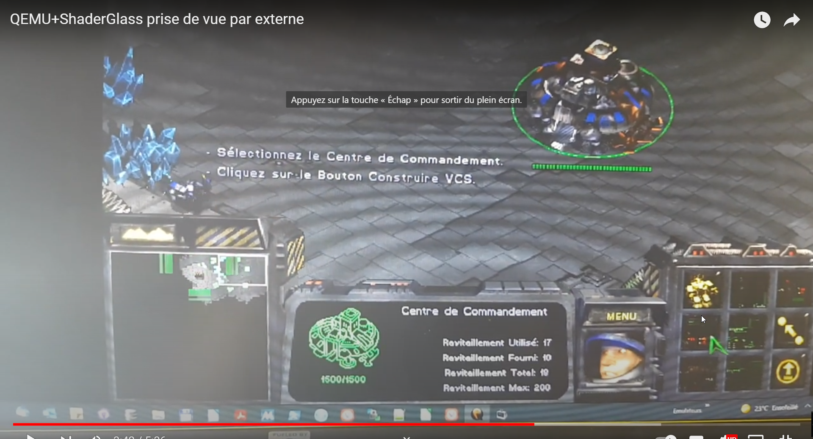
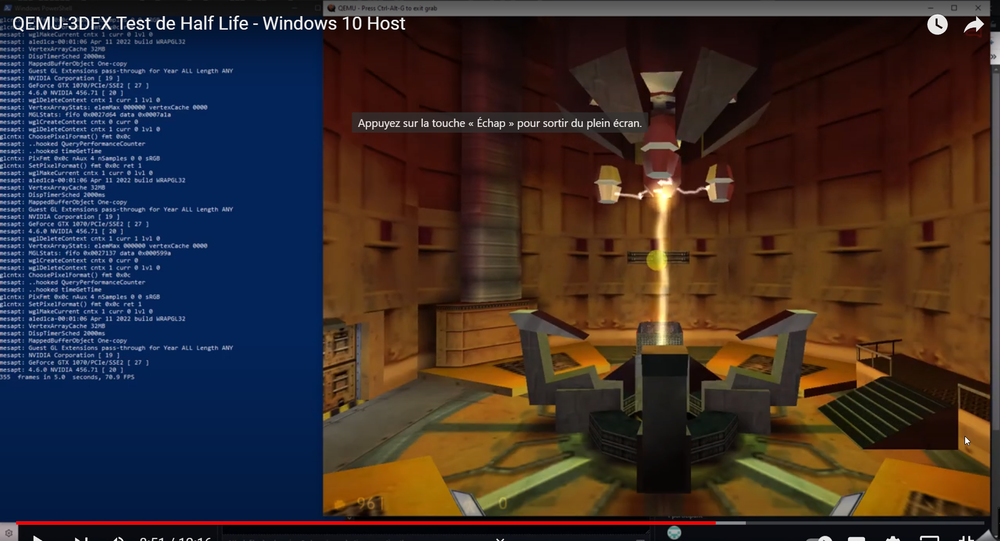
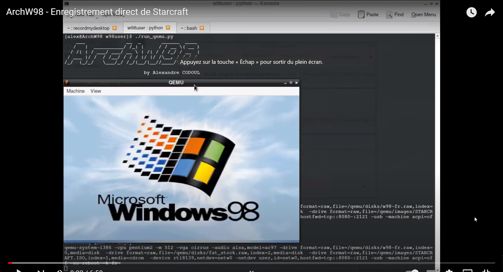

----
table {
  border: 10px solid;
  width: 100%;
  border-radius: 10px;
}

----

Welcome to the QemuPlay wiki!

Bienvenue sur QemuPlay, l'objet est d'aider à utiliser Qemu pour lancer de vieux OS. Actuellement le projet est centré sur Windows 98 qui est le plus problématique de mon point de vue. La partie 2D est pleinement fonctionnelle, la partie 3D bien moins

 

Sommaire:  
- [Qemu2D](./01-qemu2d/00-presentation.md) :  
- [Qemu3DFX](./02-qemu3dfx/)  
- [ArchW98](./03-archw98/01-presentation.md)  

 

!!! Info "Remarque"
    Je précise que je n'encourage aucunement le piratage et surtout ce qu'on appelle le l33ch, mon but est la préservation des jeux... Il est normal de payer, cela finance la créativité des développeurs, ça leur donne plus de moyens, de temps (je ne peux pas vivre de mon activité gratuite que ça soit sur le développement ou autres, donc je ne peux pas y consacrer plus de temps).

 
  
  

## Cahier des charges

- Light
- Aspect ratio préservé
- Crt Shaders
- Mise en oeuvre simplifiée pour les néophytes
- Contexte des jeux préservé **au maximum**

 
 

## Samples

Qemu2d, enregistrement direct

 

Qemu2d avec Shaderglass, prise de vue externe 

 

Qemu3DFX

 

ArchW98
